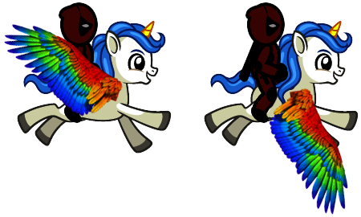

# Jumpin DeadPoo

---

## Overview

Developed by Robert Estrella

This was originally suppposed to be a platform game, but I changed the game entirely last minute (hence the name). The idea of the game came from my daughter, since she loves "flappy bird" and my son lovs "Deadpool". The objective of the game is to simply see how far you can get without "dying". Its one of the most annoying game types in the world, and literally has no end. I hope you enjoy.

---

## How to play

- <a href="https://rest2437.github.io/JumpinDeadPoo/">Click here to play Jumpin DeadPoo</a>
- Or, if you have anything you would like to add/change/modify, please feel free to fork and clone <a href="https://github.com/rest2437/JumpinDeadPoo.git">HERE!</a>

- Game loads automatically. if you die, just click restart to try again.

- Game is on a forever loop.

- Controls: Space bar is to jump/fly. Hold space to increase Y axis, let go to decrease Y axis. Tapping space is ideal.

---

## Sprites



My sprite consists of three images sourced from three different free librarys online. Using adobe photoshop, I created my sprite by combining and editing these three images and making two frames (wings up nd wings down).

- I Robert Estrella grant you permission to use for your own project.

---

## Languages and Tools

- Vanilla Javascript
- HTML5 Canvas
- CSS
- Adobe Photoshop

---

## Key Elements

---

## 1.) The player staying within canvas and hovering at idle.

- To keep the player from being able to leave the canvas I had to implement restrictions on its movement. To do this, I emplemented gravity, gave the player a weight, and gave the player canvas limitations. Here is a snippet.

```javascript
update() {
   let curve = Math.sin(angle) * 20;
   if (this.y > canvas.height - this.height + curve) {
     this.y = canvas.height - this.height + curve;
     this.vy = 0;
   } else {
     this.vy += this.weight;
     this.vy *= 0.8;
     this.y += this.vy;
   }
   if (this.y < 0 + this.height) {
     this.y = 0 + this.height;
     this.vy = 0;
   }
   if (spacePressed && this.y > this.height) this.flap();
 }
```

---

## 2.) Scrolling canvas

- The reason for the scrolling canvas is to create the illusion of the player moving and navigating through the obstacles. I did this by layering the same background over and over again, along with ajusting the frame speed so there were no splits in the scene. I alo did this without a legitimate scrolling type canvas photo.

```javascript
//Bg iamge
const background = new Image();
background.src = "BG.jpeg";
const BG = {
  x1: 0,
  x2: canvas.width,
  y: 0,
  width: canvas.width,
  height: canvas.height,
};

//scrolling BG
function handleBackground() {
  if (BG.x1 <= -BG.width + gamespeed) BG.x1 = BG.width;
  else BG.x1 -= gamespeed;
  if (BG.x2 <= -BG.width + gamespeed) BG.x2 = BG.width;
  else BG.x2 -= gamespeed;
  ctx.drawImage(background, BG.x1, BG.y, BG.width, BG.height);
  ctx.drawImage(background, BG.x2, BG.y, BG.width, BG.height);
```

---

## 3.) Obstacles, sizes, and random spawning.

- Creating the obstacles and getting them to spawn was hard. I also plan to input an image to amek it more visually appealing instead of leaving them red.

I did this by:

- creating a class for obstacles

```javascript
class Obstacle {
  constructor() {
    this.top = (Math.random() * canvas.height) / 3 + 20;
    this.bottom = (Math.random() * canvas.height) / 3 + 20;
    this.x = canvas.width;
    this.width = 40;
    this.color = "red";
    this.counted = false;
  }
```

- Creating a loop for the obstacles, and giving them paramaters such as how many to input, when to remove, and where to spawn

```javascript
update() {
    this.x -= gamespeed;
    if (!this.counted && this.x < deadpool.x) {
      score++;
      this.counted = true;
    }
    this.draw();
  }
}
function handleObstacles() {
  if (frame % 75 === 0) {
    //change value to add more obstacles
    obstaclesArray.unshift(new Obstacle());
  }
  for (let i = 0; i < obstaclesArray.length; i++) {
    obstaclesArray[i].update();
  }
  if (obstaclesArray.length > 20) {
    obstaclesArray.pop(obstaclesArray[0]);
  }
}
```

---

## Goals and future additions:

- Introduce a Start button
- Input sprite for obstacles
- Clear up Audio issues
- Input "deadpool" audio clips
- Debug collision for bottom obstacles
- Make a UI for start, pause, score keeping, etc.

---

## Disclaimer

I do not own the rights to this music, it was legally downloaded as a ring tone, and I do not plan to redistribute for profit.

DeadPool sprite developed by Robert Estrella

(I Robert Estrella grant you permission to use for your own project)
